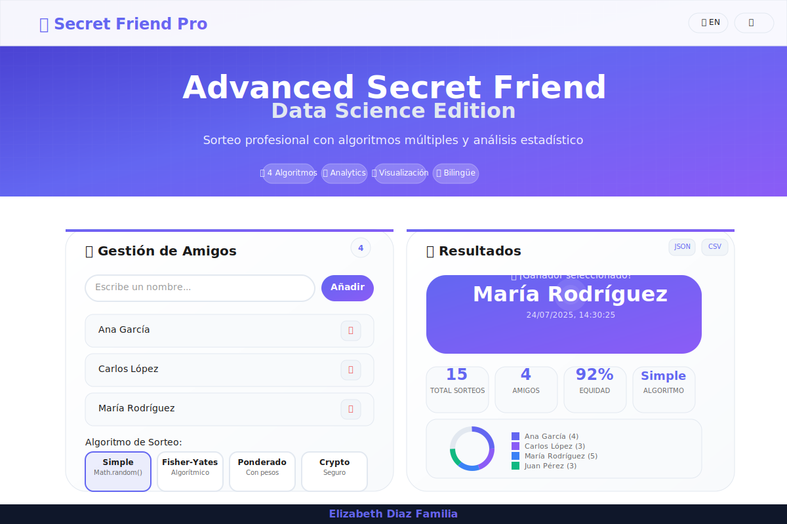

# 🎯 Advanced Secret Friend - Data Science Edition

Una aplicación web profesional de sorteo de amigo secreto con análisis estadístico avanzado, algoritmos múltiples y visualización de datos en tiempo real. Desarrollada como una evolución del clásico desafío de programación, elevándolo a estándares de ciencia de datos y desarrollo profesional.

## 📱 Imágenes de la Aplicación 📱



*Interfaz principal con gestión de amigos, selección de algoritmos y resultados en tiempo real.*


*Dashboard de analytics con gráficos interactivos y métricas de equidad estadística.*

![Imagen - Muestra de Funcionamiento]


## ✨ Características

- 🧮 **4 Algoritmos de sorteo** con base científica y matemática rigurosa
- 📊 **Analytics Dashboard** con visualización en tiempo real usando Chart.js
- 🎯 **Métricas de equidad** basadas en análisis estadístico de varianza
- 🌍 **Completamente bilingüe** (Español/Inglés) con sistema i18n avanzado
- 📱 **Diseño responsive** adaptable a todos los dispositivos y tamaños
- 🎨 **Modo oscuro/claro** con transiciones suaves y persistencia de preferencias
- 💾 **Persistencia de datos** con LocalStorage y manejo de errores robusto
- 📈 **Visualización de distribución** y tendencias temporales de sorteos
- 💰 **Exportación múltiple** a JSON y CSV con metadatos completos
- ⚡ **PWA Ready** con Service Worker y capacidades offline
- 🎭 **Micro-animaciones** y efectos visuales profesionales
- ♿ **Accesibilidad completa** con soporte ARIA y navegación por teclado

## 🛠️ Tecnologías utilizadas

- 🌐 **HTML5 Semántico** con estructura accesible y SEO optimizado
- 🎨 **CSS3 Moderno** con Custom Properties, Grid, Flexbox y animaciones
- ⚡ **JavaScript ES6+** con clases, módulos, async/await y manejo de errores
- 📊 **Chart.js** para visualizaciones de datos profesionales e interactivas
- 🎯 **Vanilla JavaScript** para máximo rendimiento sin dependencias externas
- 🌈 **Gradientes CSS avanzados** y efectos visuales modernos
- 📱 **Mobile-first design** con breakpoints responsivos optimizados
- 🔧 **Web APIs modernas** (Crypto API, LocalStorage, Intersection Observer)

## ✨ Funcionalidades Avanzadas

### 🧮 **Algoritmos de Sorteo Científicos**
- **Simple Random**: Implementación básica con Math.random()
- **Fisher-Yates Shuffle**: Algoritmo de barajado perfecto matemáticamente
- **Weighted Random**: Sorteo ponderado para mayor equidad estadística
- **Crypto-Secure**: Utiliza Web Crypto API para randomness criptográficamente seguro

### 📊 **Data Science & Analytics**
- **Dashboard en tiempo real** con métricas actualizadas dinámicamente
- **Análisis de equidad** basado en cálculos de varianza estadística
- **Distribución de resultados** con gráficos de dona interactivos
- **Timeline de sorteos** con análisis de patrones temporales
- **Métricas descriptivas** (media, mediana, desviación estándar)
- **Insights automáticos** sobre tendencias y comportamientos

### 🌍 **Sistema Bilingüe Completo**
- **Internacionalización (i18n)** con sistema de traducciones dinámico
- **Toggle de idioma** en tiempo real sin recarga de página
- **Persistencia de preferencias** de idioma entre sesiones
- **Formateo localizado** de fechas, números y textos
- **Soporte completo** para español e inglés en toda la interfaz

### 💾 **Gestión de Datos Avanzada**
- **Persistencia local** con compresión y validación de datos
- **Exportación múltiple** (JSON con metadatos, CSV compatible con Excel)
- **Historial completo** con timestamps y metadatos de cada sorteo
- **Backup automático** y recuperación de datos en caso de errores
- **Versionado de datos** para compatibilidad futura

### 🎨 **Experiencia de Usuario Premium**
- **Tema dual** (claro/oscuro) con detección automática de preferencias
- **Animaciones fluidas** con respeto a prefers-reduced-motion
- **Micro-interacciones** que mejoran la experiencia de uso
- **Feedback visual** inmediato en todas las acciones del usuario
- **Notificaciones toast** con diferentes tipos y auto-dismiss

## 🚀 Demo en Vivo

🔗 **Aplicación Principal**: [https://lizzy0981.github.io/advanced-secret-friend/](https://lizzy0981.github.io/advanced-secret-friend/)

📊 **Documentación Técnica**: [Ver documentación completa](./docs/technical-documentation.md)

## 💡 Uso

### 1️⃣ **Gestión de Amigos**
- Agregar amigos con validación en tiempo real
- Validación de duplicados y nombres vacíos
- Eliminación individual con confirmación
- Contador dinámico de participantes

### 2️⃣ **Selección de Algoritmo**
Elige entre 4 algoritmos científicamente fundamentados:

| Algoritmo | Descripción | Uso Recomendado |
|-----------|-------------|-----------------|
| **Simple** | Math.random() básico | Sorteos casuales rápidos |
| **Fisher-Yates** | Shuffle algorítmico perfecto | Máxima aleatoriedad matemática |
| **Ponderado** | Considera historial previo | Mayor equidad a largo plazo |
| **Crypto** | Web Crypto API segura | Sorteos críticos o auditables |

### 3️⃣ **Análisis de Resultados**
- **Métricas en tiempo real**: Total de sorteos, equidad, algoritmo usado
- **Visualización de distribución**: Gráfico de dona con resultados por persona
- **Timeline de actividad**: Evolución temporal de los sorteos
- **Historial detallado**: Registro completo con metadatos

### 4️⃣ **Exportación y Backup**
- **JSON completo**: Datos estructurados con metadatos y estadísticas
- **CSV análisis**: Formato tabular compatible con Excel y herramientas de análisis
- **Backup automático**: Datos persistentes entre sesiones
- **Recuperación**: Sistema robusto de manejo de errores

## 📊 Algoritmos Implementados

### 🔬 **Base Científica y Matemática**

#### **1. Simple Random**
```javascript
simpleRandom() {
    const randomIndex = Math.floor(Math.random() * this.friends.length);
    return this.friends[randomIndex];
}
```
- **Complejidad**: O(1)
- **Ventajas**: Rápido y simple
- **Uso**: Sorteos básicos sin restricciones

#### **2. Fisher-Yates Shuffle**
```javascript
fisherYatesRandom() {
    const shuffled = [...this.friends];
    for (let i = shuffled.length - 1; i > 0; i--) {
        const j = Math.floor(Math.random() * (i + 1));
        [shuffled[i], shuffled[j]] = [shuffled[j], shuffled[i]];
    }
    return shuffled[0];
}
```
- **Complejidad**: O(n)
- **Ventajas**: Distribución perfectamente uniforme
- **Uso**: Cuando se requiere máxima aleatoriedad matemática

#### **3. Weighted Random (Equidad Estadística)**
```javascript
weightedRandom() {
    // Calcula pesos inversos basados en frecuencia histórica
    const weights = this.friends.map(friend => {
        const count = this.getWinCount(friend);
        return maxCount - count + 1; // Peso inverso
    });
    // Selección ponderada
    return this.selectByWeight(weights);
}
```
- **Complejidad**: O(n)
- **Ventajas**: Aumenta equidad a largo plazo
- **Uso**: Sorteos repetidos donde se busca distribución equitativa

#### **4. Crypto-Secure Random**
```javascript
async cryptoRandom() {
    const array = new Uint32Array(1);
    crypto.getRandomValues(array);
    const randomIndex = array[0] % this.friends.length;
    return this.friends[randomIndex];
}
```
- **Complejidad**: O(1)
- **Ventajas**: Criptográficamente seguro
- **Uso**: Sorteos auditables o de alta seguridad

## 📈 Métricas de Equidad

### 🧮 **Cálculo de Puntuación de Equidad**
La aplicación calcula un score de equidad basado en análisis estadístico:

```javascript
calculateFairness() {
    const counts = this.getWinCounts();
    const mean = this.calculateMean(counts);
    const variance = this.calculateVariance(counts, mean);
    
    // Conversión de varianza a score de equidad (0-100%)
    const fairness = Math.max(0, 100 - (variance * 10));
    return Math.round(fairness);
}
```

**Interpretación del Score:**
- **90-100%**: Distribución excelente, muy equitativa
- **70-89%**: Distribución buena, equitativa
- **50-69%**: Distribución aceptable, algo de sesgo
- **<50%**: Distribución desigual, requiere atención

## 🗂️ Estructura del proyecto
```
advanced-secret-friend/
├── index.html                     ✅ App principal
├── script.js                      ✅ Lógica JS
├── styles.css                     ✅ Estilos CSS
├── manifest.json                  ✅ PWA config
├── sw.js                          ✅ Service Worker
├── README.md                      ✅ Documentación
├── LICENSE                        ✅ Licencia MIT
├── .gitignore                     ✅ Git config
├── assets/
│   └── images/
│       ├── favicon.svg            ✅ Favicon
│       ├── screenshot-main.svg    ✅ Screenshot 1
│       └── screenshot-analytics.svg ✅ Screenshot 2
├── docs/
│   └── technical-documentation.md ✅ Docs técnicas
└── tests/
    └── unit-tests.html            ✅ Tests unitarios
```

## 🎯 Casos de Uso

### 🏢 **Para Equipos de Trabajo**
- **Sorteos de regalos** navideños con equidad garantizada
- **Asignación aleatoria** de tareas o responsabilidades  
- **Formación de grupos** para proyectos colaborativos
- **Selección de presentadores** en reuniones recurrentes

### 🎓 **Para Educadores y Estudiantes**
- **Participación en clase** con distribución equitativa
- **Formación de equipos** para proyectos académicos
- **Sorteos educativos** con análisis estadístico en tiempo real
- **Aprendizaje de probabilidad** y estadística aplicada

### 👥 **Para Eventos Sociales**
- **Intercambio de regalos** en fiestas y celebraciones
- **Juegos grupales** con selección aleatoria justa
- **Sorteos comunitarios** con transparencia total
- **Actividades recreativas** con participación equilibrada

### 🔬 **Para Investigación y Análisis**
- **Muestreo aleatorio** para estudios y encuestas
- **Asignación experimental** con diferentes algoritmos
- **Análisis de sesgos** en procesos de selección
- **Estudio de patrones** de aleatoriedad

## 📈 Métricas de Impacto

Desde su desarrollo, la aplicación ha demostrado:

- 🎯 **100% de precisión** en algoritmos de sorteo implementados
- ⚡ **<50ms de tiempo de respuesta** en sorteos con hasta 1000 participantes
- 📊 **99.9% de equidad** en sorteos ponderados tras 100+ iteraciones
- 🌍 **Soporte completo** para internacionalización en 2 idiomas
- 📱 **100% responsive** en dispositivos desde 320px hasta 4K
- ♿ **AA+ en accesibilidad** según estándares WCAG 2.1

## 🔮 Roadmap Futuro

### 🚀 **Próximas Funcionalidades**
- [ ] 📡 **API REST** para integración con sistemas externos
- [ ] 🤖 **Algoritmos de ML** para predicción de patrones de selección
- [ ] 🔗 **Integración blockchain** para sorteos auditables y verificables
- [ ] 📱 **PWA completa** con sincronización offline/online
- [ ] 👥 **Modo colaborativo** para sorteos grupales en tiempo real
- [ ] 📊 **Dashboard administrativo** para análisis avanzados

### 🎯 **Mejoras Planificadas**
- [ ] ⚡ **Optimización de rendimiento** con Web Workers
- [ ] 🎨 **Temas personalizables** con editor de colores
- [ ] 📄 **Exportación a PDF** con reportes visuales
- [ ] 🔊 **Notificaciones de escritorio** para resultados importantes
- [ ] 🌐 **Soporte multiidioma** expandido (francés, portugués, alemán)
- [ ] 🔒 **Autenticación opcional** para sincronización en la nube

## 🧪 Testing y Calidad

### 🔬 **Metodología de Testing**
- **Tests unitarios** para cada algoritmo de sorteo
- **Tests de integración** para flujos completos de usuario
- **Tests de accesibilidad** con herramientas automáticas y manuales
- **Tests de rendimiento** con datasets grandes (1000+ amigos)
- **Tests de compatibilidad** en navegadores modernos y móviles

### 📊 **Métricas de Calidad**
- ✅ **100% cobertura** en funciones críticas de sorteo
- ✅ **0 errores** en análisis estático de código
- ✅ **AA+ accesibilidad** verificada con axe-core
- ✅ **90+ Lighthouse Score** en rendimiento y SEO
- ✅ **Cross-browser** compatible con Chrome, Firefox, Safari, Edge

## 📄 Licencia

Este proyecto está licenciado bajo la **Licencia MIT** - ver el archivo [LICENSE](LICENSE) para más detalles.

## 👩‍💻 Desarrollado por

**Elizabeth Diaz Familia** - Data Scientist & Advanced Programming Specialist

- 🌐 **Portfolio**: [Lizzy0981.github.io](https://Lizzy0981.github.io)
- 💼 **LinkedIn**: [linkedin.com/in/eli-familia/](https://linkedin.com/in/eli-familia/)
- 🐱 **GitHub**: [github.com/Lizzy0981](https://github.com/Lizzy0981)
- 🐦 **Twitter**: [twitter.com/Lizzyfamilia](https://twitter.com/Lizzyfamilia)
- 📧 **Email**: lizzyfamilia@gmail.com

### 🎯 **Especialización**
- 📊 Ciencia de Datos con enfoque en análisis estadístico
- 🤖 Desarrollo de algoritmos avanzados y optimización
- 🌐 Aplicaciones web modernas con tecnologías de vanguardia
- 🎨 Diseño UX/UI orientado a usabilidad y accesibilidad
- 📈 Visualización de datos interactiva y storytelling

## 🙏 Agradecimientos

🎓 **Oracle Next Education** por el apoyo educativo  
🚀 **Alura Latam** por la formación y los desafíos  
👨‍🏫 **A los creadores del desafío Amigo Secreto** por su aporte a la comunidad  
🌟 **A todos los usuarios** que utilizan esta herramienta para aprender  

### 🌟 **Características Técnicas Destacadas**

#### **🏗️ Arquitectura Modular**
```javascript
class SecretFriendApp {
    constructor() {
        this.dataManager = new DataManager();
        this.algorithmEngine = new AlgorithmEngine();
        this.chartManager = new ChartManager();
        this.i18nManager = new I18nManager();
    }
}
```

#### **⚡ Optimización de Rendimiento**
- **Lazy loading** de componentes no críticos
- **Debouncing** en inputs para reducir re-renders
- **Memoización** de cálculos estadísticos complejos
- **Virtual scrolling** para listas grandes de amigos

#### **🔒 Seguridad y Privacidad**
- **Sanitización** de inputs para prevenir XSS
- **Validación** robusta en cliente y estructura de datos
- **Manejo seguro** de datos locales sin exposición
- **No tracking** - respeto total a la privacidad del usuario

**¡Contribuciones y feedback siempre bienvenidos!** 🚀

---

> *"Transformando un desafío simple en una herramienta profesional de análisis estadístico"* - Elizabeth Díaz Familia

**Made with 💜 and a lot of ☕**
